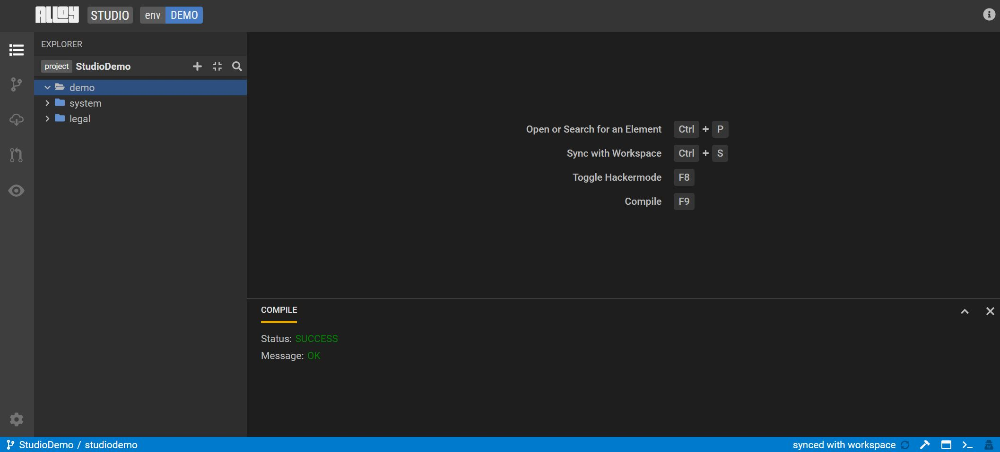
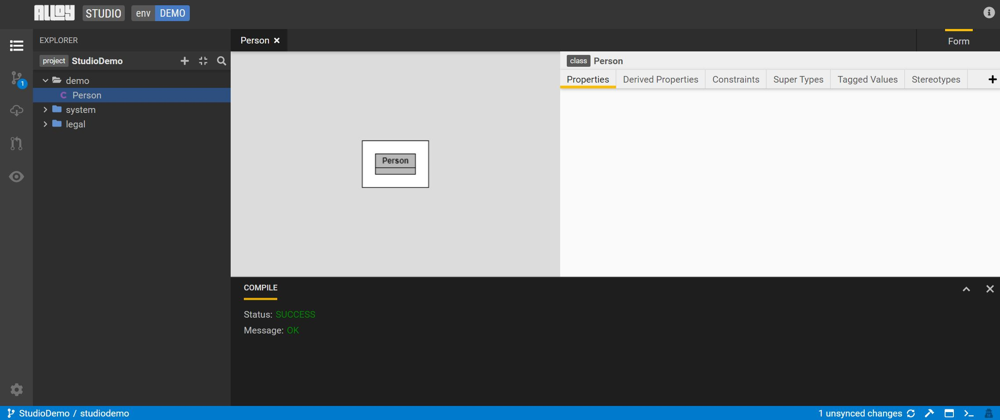
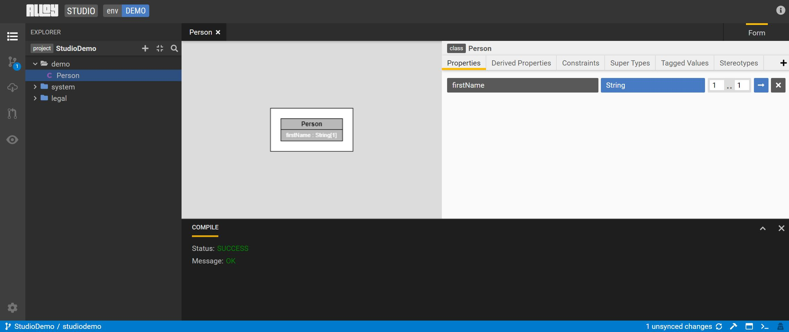
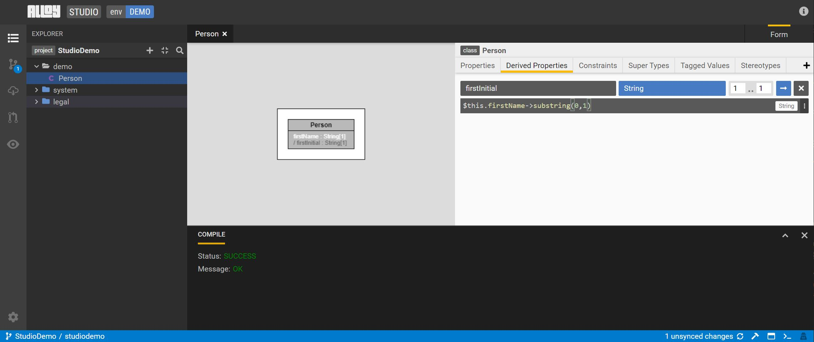
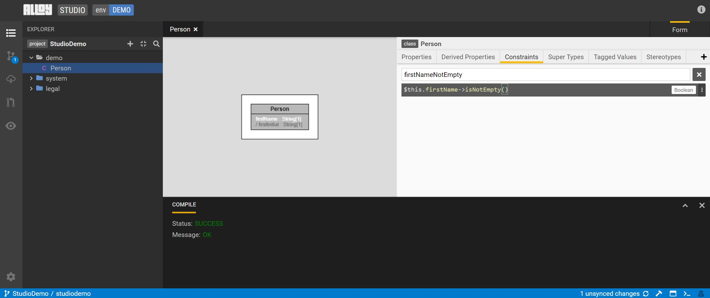
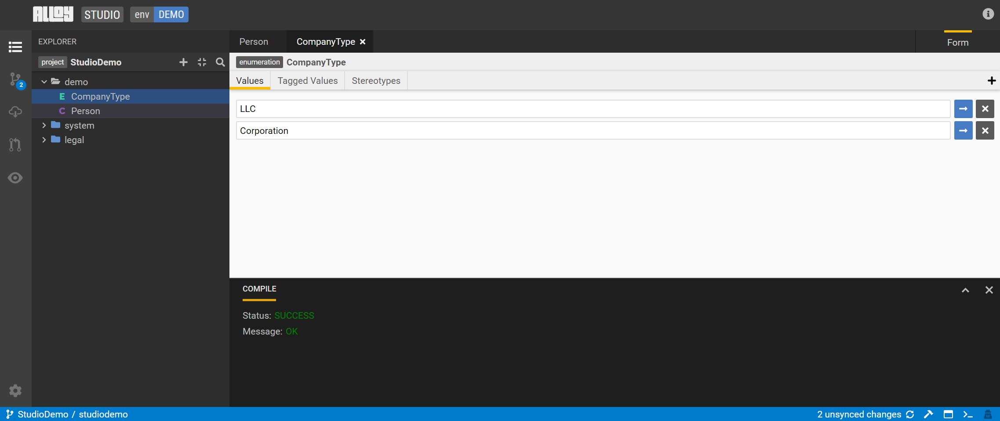
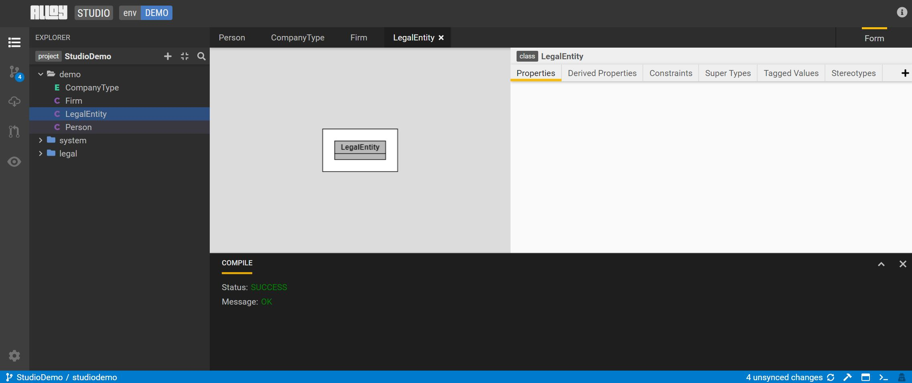
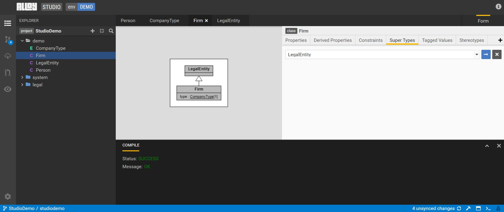
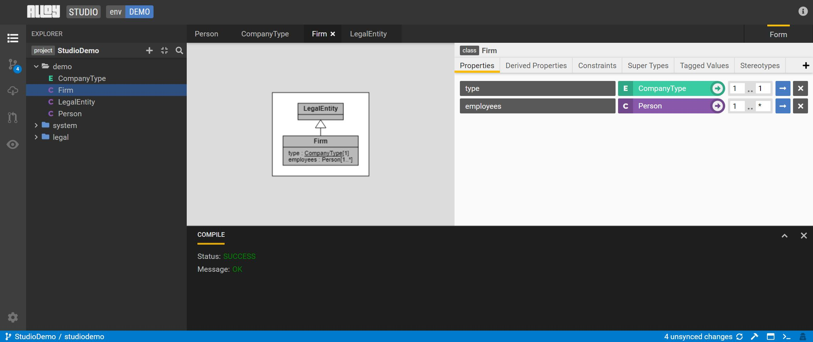

# Create a Model

Use models to describe your data and how they relate to each other.

## Define a Model Hierarchy

Use model hierarchies to group models into packages. 

1. Click the **+** icon next to **project**.
2. Click **Add a new package** to start a model hierarchy.

    

## Define a New Class

Use classes to define a business concept.

1. Click the **+** icon.
2. Click **Add a new Class**.

    Let's create a class called `Person`.  

    

    Studio displays a visualization of the class and a tabbed list of the possible model enrichments.

## Add a Property (primitive data type)

Use properties in a class to define attributes of the business concept.

1. Go to the **Properties** tab and click the **+** icon.
2. Type in the name of your property and specify the [data type](legend-language.md#primitive-types) and [cardinality](legend-language.md#class).

    Let's create a property called `firstName` of type `String` with [cardinality](legend-language.md#class) of 1.  

    

## Add a Derived Property

Derived properties are properties defined using functions that can operate on other attributes in the data model.

1. Go to the **Derived Properties** tab and click the **+** icon.
2. Type in the name of your property and specify the [data type](legend-language.md#primitive-types) and [cardinality](legend-language.md#class).
3. Type in the expression.

    Let's add a qualified property called `firstInitial` using the following expression: `$this.name->substring(0,1)`.

4. Select a return [data type](legend-language.md#primitive-types) of `String` and [cardinality](legend-language.md#class) of 1.
5. Press **F9** to compile the expression.

    

## Add a Constraint

Use constraints to define a validation or condition on the model that's expected to be met. The return type for a constraint is **Boolean**.  

1. Go to the **Constraints** tab and click the **+** icon.
2. Type in a name for the constraint and the expression.  

    Let's add a constraint called `firstNameNotEmpty` using the following expression: `$this.firstName->isNotEmpty()`.

3. Press **F9** to compile the expression.

    

## Add a Tagged Value

Use tagged values to add context and values to your model. One type of tagged value is `doc`. The `doc` tag describes the class.

1. Go to the **Tagged Values** tab and click the **+** icon.

2. Select the tagged value to add.

    Let's add a `doc` tag to describe the **Person** class.

    

## Add a Stereotype

Use stereotypes to extend metadata information about a model. For example, you can annotate your model with labels like *legacy* or *deprecated*.

1. Go to the **Stereotypes** tab and click the **+** icon.  
2. Select the sterotype class.

    Let's add a stereotype of type **access** and a value of **public**.

    

## Create and Add an Enumeration

A model attribute that has a finite list of values can be defined with an enumeration.

1. Click the **+** icon on the left-hand side and select **Add an enumeration**.
2. Select the values for the enumeration.

    Let's create an enumeration called **CompanyType** with the values **LLC** and **Corporation**.

    

3. Create a new class called **Firm** with a property named **type**.
4. Select **CompanyType** for the property type and a [cardinality](legend-language.md#class) of 1.

    

## Add a Super Type

Add a Super Type to the model to show a relationship between classes or business concepts.

Let's create a new class called **LegalEntity**.  

1. Moving back to the **Firm** class, go to the **Super Types** tab and click the **+** icon.
2. Select the **LegalEntity** class from the dropdown.

    The model visualization on the left now shows the **LegalEntity** class as a super type of **Firm**.

    

## Add a Property (non-primitive data type)

Create a relationship between the **Person** and **Firm** classes.

1. In the **Firm** class, create a property with the following values:
    - Name: **employees**
    - Type: **Person**
    - Cardinality: **1..**

    

## Next steps

- [Create a diagram](create-diagram.md)
- [Edit a model](edit-model.md)
- [Create a model-to-model mapping](create-model-to-model-mapping.md)
